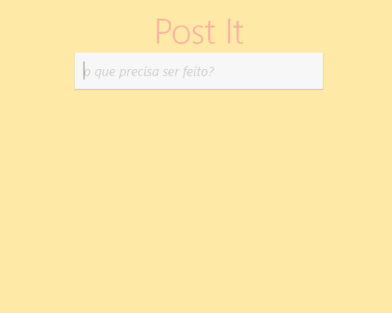
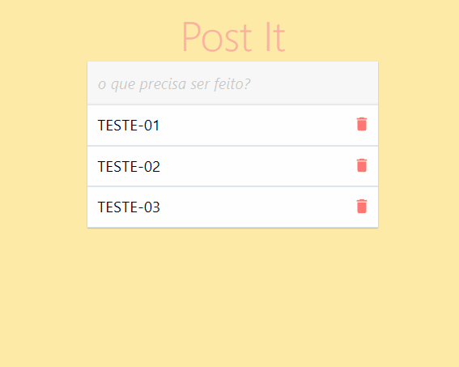
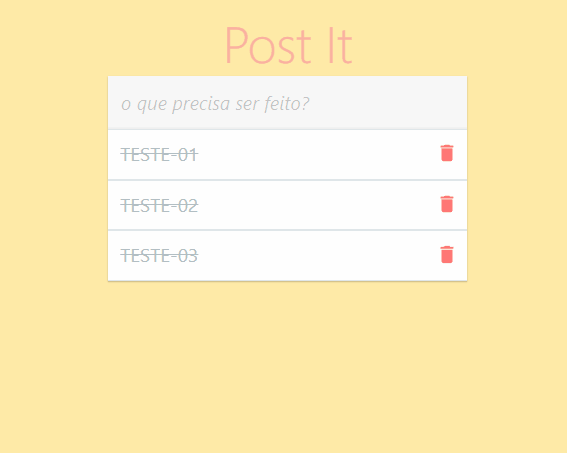
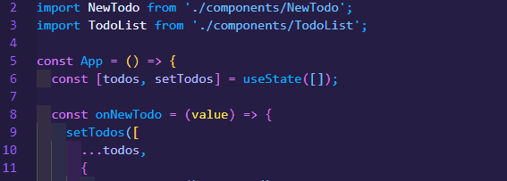

# <strong><p align="center">README</p></strong>

<p align="center">Esse projeto tem como foco em fazer uma tela de anotações identico ao um postite para lembrar posteriormente, além disso quando finalizado, você consegue deixar riscado a sua anotação ou encaminhar para lixeira o mesmo.</p>

<br>

<p align="center">
<a href="Sobre">Sobre</a>
<a href="Roadmap">Roadmap</a>
<a href="Tecnologias">Tecnologias</a>
<a href="Pré-requisitos">Pré Requisitos</a>
</p>

# <h2>Sobre</h2>
<p>Produzido na cor amarela, o post-it é um pequeno pedaço de papel com uma tira adesiva, criado para permitir que as pessoas escrevam lembretes temporários sobre datas ou tarefas.</p>

<br>

# <h2>Roadmap</h2>





<br>

# <h2>🦾👾 Tecnologias</h2>

<p>As seguintes ferramentas foram usadas na construção do projeto:</p>

- [HTML](https://developer.mozilla.org/pt-BR/docs/Web/HTML)
- [CSS](https://developer.mozilla.org/pt-BR/docs/Web/CSS)
- [JAVASCRIPT](https://developer.mozilla.org/pt-BR/docs/Web/JavaScript)
- [REACT.JS](https://pt-br.reactjs.org)

<br>


# <h2>Pré-requisitos</h2>

Antes de começar, você vai precisar ter instalado em sua máquina as seguintes ferramentas: [GIT](https://git-scm.com/downloads), [NODE.JS](https://nodejs.org/en/download/). Além disto é bom ter um editor para trabalhar ou visualizar o código como [VSCODE](https://code.visualstudio.com/download).

### 🤖 Rodando o Front End

```bash
## Clone este repositório
$ git clone https://github.com/RodrigoSilva95/Postite

## Acesse a pasta do projeto no terminal/cmd
$ cd Postite

## Instale as dependências
$ yarn e npm

## Execute a aplicação em modo desenvolvimento
$ yarn start ou npm

## O servidor iniciará na porta: 3000 - acesse <https://localhost:3000>
$ Por fim, execute e teste aplicação.
```
<hr>
<br>

😁👍 [Siga-me no LinkedIn](https://www.linkedin.com/in/rodrigo-de-lima-santos-silva/)
